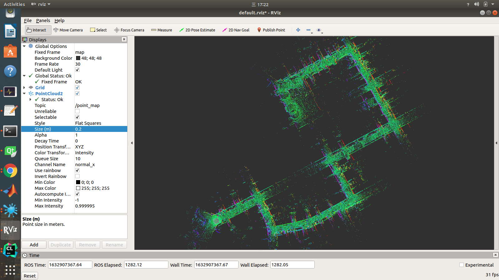
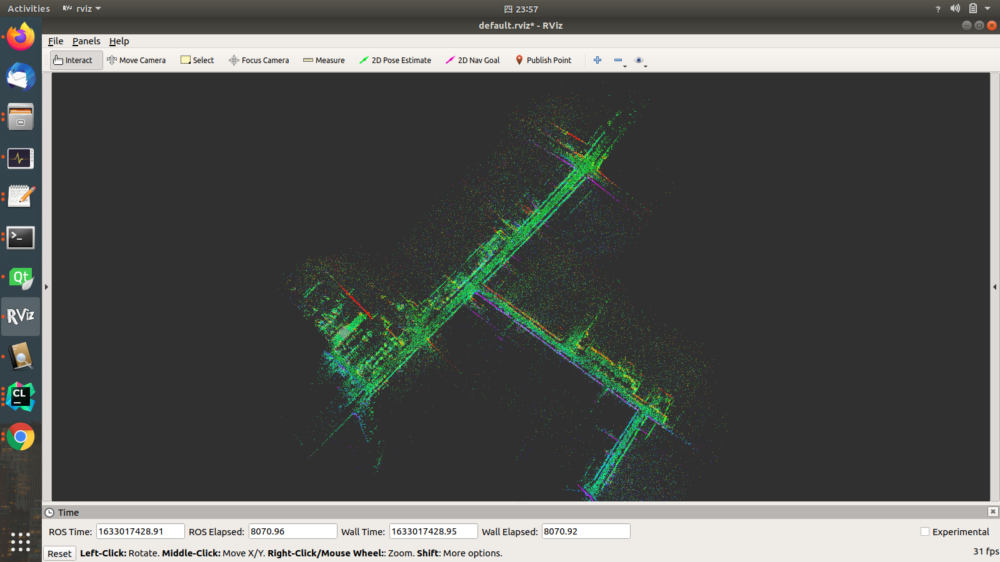

# The ROS version of ICP Mapping with QPEP Solver (Quadratic Pose Estimation Problems)

The project is based on https://github.com/ethz-asl/ethzasl_icp_mapping

It is mainly there for us to try quick demos and as an example of [libpointmatcher](https://github.com/ethz-asl/libpointmatcher) and its QPEP variant https://github.com/zarathustr/libpointmatcher_QPEP codes

The project has been tested on ROS Indigo (Ubuntu 14.04), Kinetic (Ubuntu 16.04) and Melodic (Ubuntu 18.04). The newst results show that ROS Noetic (Ubuntu 20.04, Mac OS Big Sur 11.5) may not be compatible with the TF transformations.

This [ROS] stack provides a real-time 2D and 3D [ICP]-based SLAM system that
can fit a large variety of robots and application scenarios, without any code
change or recompilation.

## Compilation
```
cd catkin_ws/src
git clone https://github.com/zarathustr/icp_mapping_QPEP
catkin build
```

## QPEP Demos
To run the Point-to-Plane based Iterative Closest Point (ICP) algorithm by QPEP solver, we may run the ```roslaunch``` files from ```ethzasl_icp_mapper/launch/kitti/kitti.launch``` (for KITTI Dataset) and ```ethzasl_icp_mapper/launch/icsens/icsens_outdoor.launch``` (for the I.C.Sens Dataset, https://data.uni-hannover.de/dataset/i-c-sens-visual-inertial-lidar-dataset).

Here are performances:

KITTI Dataset:




I.C.Sens Dataset:




## Extended Reading

Information about this stack, including installation and compilation, is available on the [ROS] wiki at [http://www.ros.org/wiki/ethzasl_icp_mapping](http://www.ros.org/wiki/ethzasl_icp_mapping).

[ROS]: http://www.ros.org
[ICP]: http://en.wikipedia.org/wiki/Iterative_Closest_Point
[QPEP]: https://github.com/zarathustr/LibQPEP

## Reference
Wu, J., Zheng, Y., Gao, Z., Jiang, Y., Hu, X., Zhu, Y., Jiao, J., Liu*, M. (2020) Quadratic Pose Estimation Problems: Globally Optimal Solutions, Solvability/Observability Analysis and Uncertainty Description.
